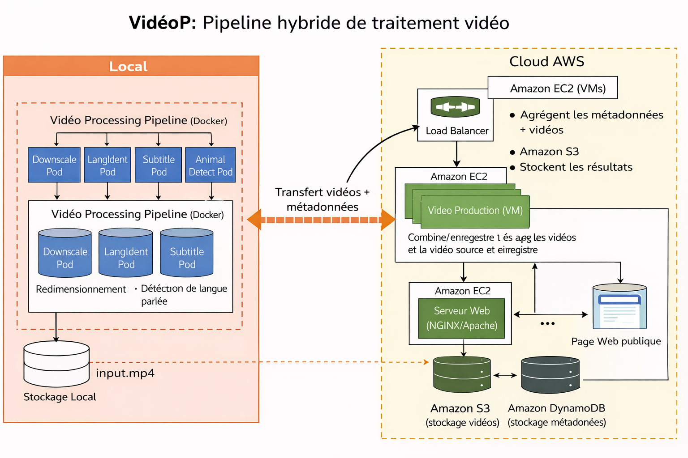

# VideoP – Pipeline hybride de traitement vidéo
# -- DOCUMENTATION --
## 1. Présentation du projet

**VideoP** est un pipeline hybride de traitement vidéo conçu dans le cadre du cours de **Cloud Computing**.  
Le projet illustre une architecture distribuée combinant :

- un **traitement local** basé sur des conteneurs Docker,
- une **agrégation et exposition des résultats dans le Cloud (AWS)**.

Le pipeline automatise le traitement de vidéos stockées localement, génère des métadonnées, puis centralise les résultats sur des services Cloud accessibles publiquement via une page web.

---

## 2. Objectifs pédagogiques

- Mettre en œuvre une architecture **hybride Local / Cloud**
- Utiliser la **conteneurisation (Docker)**
- Exploiter des services Cloud AWS (EC2, S3, DynamoDB)
- Comprendre la notion de **pipeline distribué**
- Déployer une **application accessible publiquement**
- Identifier les limites d’un déploiement Cloud académique

---

## 3. Architecture globale

### Vue d’ensemble



---

## 5. Exécution du pipeline en local (Docker)

### 5.1 Prérequis

- Docker ≥ 20.x
- Docker Compose
- Système Linux / Windows / macOS
- git 

Vérification :
```bash
docker --version
docker compose version
git --version
```
#### Cloner le dépôt
```bash
git clone https://github.com/xender237/Project_VidP.git
cd Project_VidP
```
### 5.2 Lancer le pipeline

Placer une vidéo .mp4 dans le dossier : videos/input.mp4

Lancer le pipeline :
```bash
docker compose up --build
```
---

5.3 Résultats générés

Après exécution, le dossier data/ contient de nouveaux fichiers

---

## 6. Description des Pods (conteneurs)
Downscale Pod

Compression et redimensionnement de la vidéo

Utilise FFmpeg

LangIdent Pod

Détection de la langue parlée (simulation via texte)

Génère un fichier JSON de métadonnées

Subtitle Pod

Génération de sous-titres au format SRT

Simulation académique

Animal Detect Pod

Analyse de frames vidéo

Détection simplifiée d’animaux

Implémentation légère sans GPU (contexte TP)

---

## 7. Déploiement Cloud AWS
7.1 Services utilisés

EC2 (t2.micro / t3.micro) – VM Linux

Amazon S3 – Stockage des vidéos

Amazon DynamoDB – Stockage des métadonnées

NGINX – Page web publique

Tous les services sont compatibles avec le Free Tier AWS.

7.2 Création de l’instance EC2

OS : Ubuntu 22.04

Type : t2.micro

Ports ouverts :

22 (SSH)

80 (HTTP)

Connexion :

```bash
ssh -i videop.pem ubuntu@<IP_EC2>
```

7.3 Installation des dépendances sur EC2

```bash
sudo apt update
sudo apt install -y python3-pip nginx
pip3 install boto3
```
---

## 8. Transfert des résultats vers le Cloud

Depuis la machine locale :

```bash
scp -i videop.pem -r data ubuntu@<IP_EC2>:/home/ubuntu/
```

---

## 9. Upload vers Amazon S3

Créer un bucket S3 (nom unique)

Configurer les droits IAM (S3 + DynamoDB)

Exécuter sur EC2 :

```bash
python3 cloud/upload_to_s3.py
```

---

## 10. Stockage des métadonnées dans DynamoDB

Créer une table DynamoDB :

Partition Key : video_id

Exécuter :

```bash
python3 cloud/dynamodb.py
```
---

## 11. Déploiement de la page web publique
```bash
sudo cp web/index.html /var/www/html/index.html
sudo systemctl restart nginx
```


Accès :

```bash
http://<IP_EC2>
```

La page affiche la vidéo stockée sur S3.

---

## 12. Limites du projet

Détection d’animaux simplifiée (pas de modèle IA lourd)

Pas de montée en charge (scalabilité non testée)

Sous-titres simulés

Déploiement Cloud temporaire (TP académique)

---

## 13. Conclusion

Ce projet démontre la mise en place d’un pipeline hybride de traitement vidéo, combinant conteneurisation locale et services Cloud AWS.
Il illustre concrètement les concepts fondamentaux du Cloud Computing : distribution, stockage distant, services managés et exposition publique.

---

## 14. Auteurs

Projet réalisé dans le cadre du cours de Cloud Computing.
